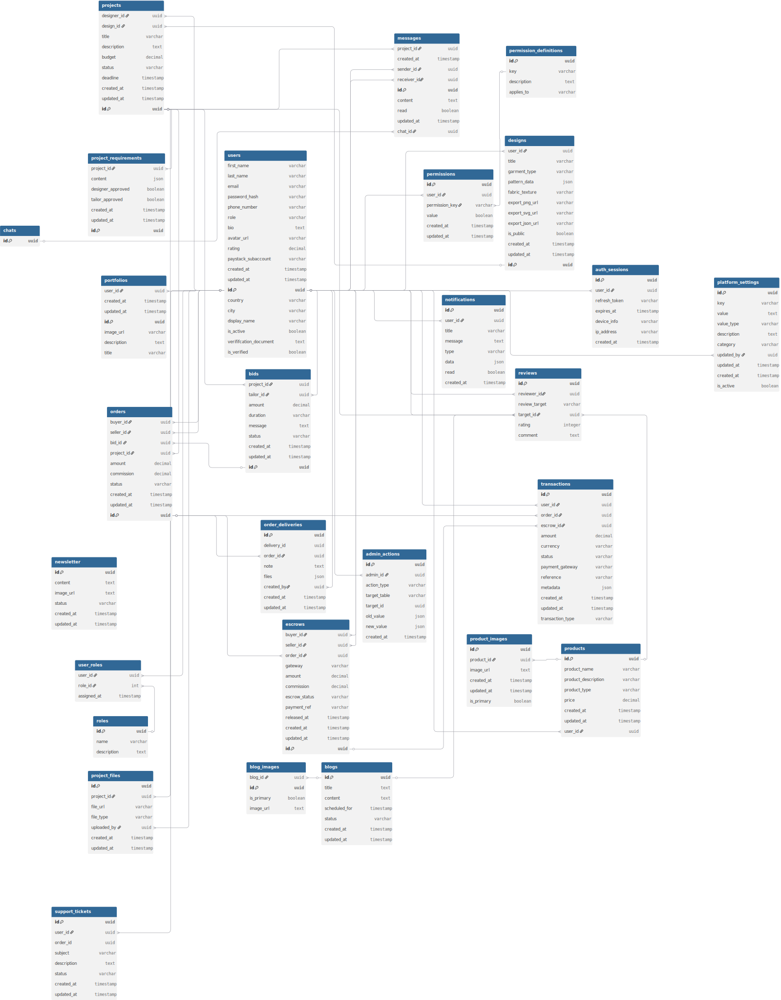

Table users {
	first_name varchar
	last_name varchar
	email varchar unique
	password_hash varchar
	phone_number varchar
	role varchar
	bio text
	avatar_url varchar
	rating decimal
	paystack_subaccount varchar
	created_at timestamp
	updated_at timestamp
	id uuid pk
	country varchar
	city varchar
	display_name varchar
  is_active boolean
  verififcation_document text
  is_verified boolean
}

Table newsletter {
  id uuid pk
  content text
  image_url text
  status varchar
  created_at timestamp
  updated_at timestamp
}

Table permissions {
  id uuid pk
  user_id uuid
  permission_key varchar
  value boolean
  created_at timestamp
  updated_at timestamp
}

Table permission_definitions {
  id uuid pk
  key varchar
  description text
  applies_to varchar
}

Table designs {
	user_id uuid
	title varchar
	garment_type varchar
	pattern_data json
	fabric_texture varchar
	export_png_url varchar
	export_svg_url varchar
	export_json_url varchar
	is_public boolean
	created_at timestamp
	updated_at timestamp
	id uuid pk
}

Table projects {
	designer_id uuid
	design_id uuid
	title varchar
	description text
	budget decimal
	status varchar
	deadline timestamp
	created_at timestamp
	updated_at timestamp
	id uuid pk
}

Table project_requirements {
	project_id uuid
	content json
	designer_approved boolean
	tailor_approved boolean
	created_at timestamp
	updated_at timestamp
	id uuid pk
}

Table bids {
	project_id uuid
	tailor_id uuid
	amount decimal
	duration varchar
	message text
	status varchar
	created_at timestamp
	updated_at timestamp
	id uuid pk
}

Table blogs {
  id uuid pk
  title text
  content text
  scheduled_for timestamp
  status varchar
  created_at timestamp
  updated_at timestamp
}

Table blog_images{
  blog_id uuid
  id uuid pk
  is_primary boolean
  image_url text
}

Table orders {
	buyer_id uuid
	seller_id uuid
	bid_id uuid
	project_id uuid
	amount decimal
	commission decimal
	status varchar
	created_at timestamp
	updated_at timestamp
	id uuid pk
}

Table escrows {
  buyer_id uuid
  seller_id uuid
	order_id uuid
	gateway varchar
	amount decimal
	commission decimal
	escrow_status varchar
	payment_ref varchar
	released_at timestamp
	created_at timestamp
	updated_at timestamp
	id uuid pk
}

Table order_deliveries {
	id uuid pk
	delivery_id uuid
	order_id uuid
	note text
	files json
	created_by uuid
	created_at timestamp
  updated_at timestamp
}

Table messages {
	project_id uuid
	created_at timestamp
	sender_id uuid
	receiver_id uuid
	id uuid pk
	content text
	read boolean
	updated_at timestamp
	chat_id uuid
}

Table chats{
  id uuid pk
}

Table portfolios {
	user_id uuid
	created_at timestamp
	updated_at timestamp
	id uuid pk
	image_url varchar
	description text
	title varchar
}

Table notifications {
	id uuid pk
	user_id uuid
	title varchar
	message text
	type varchar
	data json
	read boolean
	created_at timestamp
}

Table auth_sessions {
	id uuid pk
	user_id uuid
	refresh_token varchar
	expires_at timestamp
	device_info varchar
	ip_address varchar
	created_at timestamp
}

Table products {
	id uuid pk
	product_name varchar
	product_description varchar
  product_type varchar
	price decimal
	created_at timestamp
	updated_at timestamp
	user_id uuid
}

Table support_tickets {
  id uuid pk
  user_id uuid
  order_id uuid
  subject varchar
  description text
  status varchar
  created_at timestamp
  updated_at timestamp
}

Table reviews {
	id uuid pk
	reviewer_id uuid
	review_target varchar
	target_id uuid
	rating integer
	comment text
}

Table product_images {
	id uuid pk
	product_id uuid
	image_url text
	created_at timestamp
	updated_at timestamp
	is_primary boolean
}

Table transactions {
	id uuid pk
	user_id uuid
	order_id uuid
	escrow_id uuid
	amount decimal
	currency varchar
	status varchar
	payment_gateway varchar
	reference varchar unique
	metadata json
	created_at timestamp
	updated_at timestamp
	transaction_type varchar
}

Table platform_settings {
    id uuid pk
    key varchar unique
    value text                      
    value_type varchar
    description text               
    category varchar               
    updated_by uuid   
    updated_at timestamp
    created_at timestamp
    is_active boolean
}

Table roles {
  id uuid pk
  name varchar
  description text
}

Table user_roles {
  user_id uuid
  role_id int
  assigned_at timestamp
}

Table project_files {
  id uuid pk
  project_id uuid
  file_url varchar
  file_type varchar
  uploaded_by uuid
  created_at timestamp
  updated_at timestamp
}

Table admin_actions {
  id uuid pk
  admin_id uuid
  action_type varchar
  target_table varchar
  target_id uuid
  old_value json
  new_value json
  created_at timestamp
}

Ref: designs.user_id > users.id
Ref: projects.designer_id > users.id
Ref: projects.design_id > designs.id
Ref: project_requirements.project_id > projects.id
Ref: bids.project_id > projects.id
Ref: bids.tailor_id > users.id
Ref: orders.buyer_id > users.id
Ref: orders.seller_id > users.id
Ref: orders.bid_id > bids.id
Ref: orders.project_id > projects.id
Ref: escrows.order_id > orders.id
Ref: order_deliveries.order_id > orders.id
Ref: order_deliveries.created_by > users.id
Ref: messages.project_id > projects.id
Ref: messages.sender_id > users.id
Ref: messages.receiver_id > users.id
Ref: portfolios.user_id > users.id
Ref: notifications.user_id > users.id
Ref: auth_sessions.user_id > users.id
Ref: transactions.user_id > users.id
Ref: transactions.order_id > orders.id
Ref: transactions.escrow_id > escrows.id
Ref: products.user_id > users.id
Ref: product_images.product_id > products.id
Ref: reviews.target_id > users.id
Ref: reviews.reviewer_id > users.id
Ref: reviews.target_id > products.id
Ref: reviews.target_id > projects.id
Ref: user_roles.user_id > users.id
Ref: user_roles.role_id > roles.id
Ref: project_files.project_id > projects.id
Ref: project_files.uploaded_by > users.id
Ref: escrows.buyer_id > users.id
Ref: escrows.seller_id > users.id
Ref: blog_images.blog_id > blogs.id
Ref: reviews.target_id > blogs.id
Ref: permissions.user_id > users.id
Ref: platform_settings.updated_by > users.id
Ref: permissions.permission_key > permission_definitions.key
Ref: messages.chat_id > chats.id
Ref: admin_actions.admin_id > users.id
Ref: support_tickets.user_id > users.id

